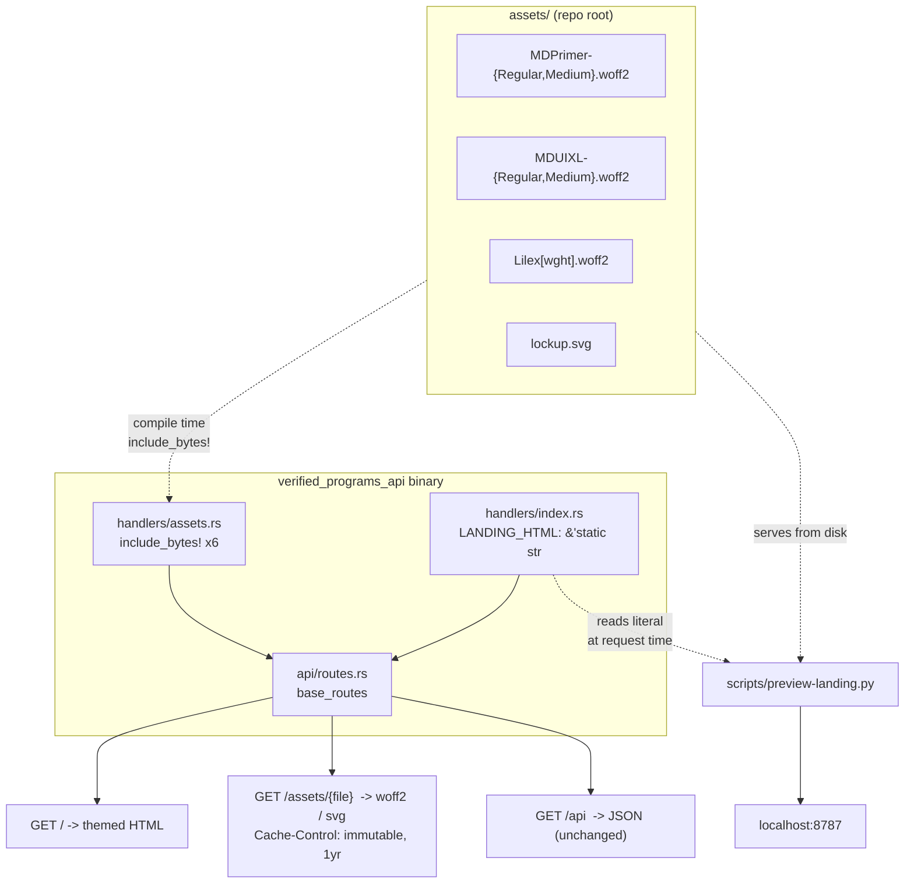

# feat: Retheme the verify.osec.io landing page in the osec.io design language

**Target repo:** `solana-verified-programs-api` (this repo)
**Reference repo:** `osec.io` (sibling checkout, read-only — design source of truth)

---

## Summary

`GET /` currently returns a 2.2 KB unstyled HTML stub with a system font stack, rounded grey cards, and no brand identity. It shares a domain and an owner with `osec.io` but none of its design language. This plan rebuilds that page in the OtterSec design system — Radix gray tokens, the MD Primer / MD UI XL / Lilex type stack, the hairline-gradient surface treatment, pill actions, and a grain-lit dark canvas — while keeping the page a single self-contained string served by the existing axum handler.

Scope is the landing page at `/` plus the asset routes it needs. `GET /api` stays JSON.

---

## Problem Frame

`src/api/handlers/index.rs` holds `LANDING_HTML`, a `&'static str` served by `landing_page()` and routed at `src/api/routes.rs` under `base_routes`. The page works, but:

- It looks like a default. No brand mark, no OtterSec typography, no shared color system.
- It is the public face of a service that OtterSec runs and that Solana program authors are told to trust. Visual continuity with `osec.io` is a credibility signal, not decoration.
- The service has no static-file serving at all (no `tower_http::services::ServeDir`), so any font or logo the new design needs has to arrive through a deliberate mechanism.

The constraint that shapes everything: this is a Rust binary with no asset pipeline. Whatever the page needs must either be inlined in the string or compiled into the binary with `include_bytes!`.

---

## Requirements

| ID | Requirement |
|----|-------------|
| R1 | `GET /` returns a landing page visually consistent with `osec.io`: same color tokens, type scale, font families, surface treatment, and button system. |
| R2 | `GET /api` continues to return the existing JSON endpoint catalog, byte-identical in shape. It is a public API contract. |
| R3 | The page renders correctly in both light and dark, following the OS preference by default, with a working manual toggle that persists. |
| R4 | Brand fonts and the OtterSec lockup are served by the binary itself, cached aggressively, with no external network dependency at render time. |
| R5 | The page degrades gracefully: metric-matched fallback fonts, no layout shift, no JS required for content to be readable. |
| R6 | The maintainer can view the finished page on `localhost` without provisioning Postgres or an RPC endpoint. |
| R7 | `cargo fmt --check`, `cargo clippy -D warnings`, `cargo sort --check`, and `cargo machete` all pass — CI runs these on every push. |

---

## Key Technical Decisions

### KTD1 — Compile assets into the binary via `include_bytes!`, serve them on dedicated routes

**Decision:** Add an `assets/` directory at the repo root holding the woff2 faces and the lockup SVG. Serve the fonts from a new `assets` handler module on `/assets/{file}` routes registered inside `base_routes`. The lockup is *not* served — see the amendment below.

**Amended during implementation:** the lockup's gradient stops reference `var(--foreground)`, so it only picks up the theme when inlined into the document. Served through `` it renders with unresolved colour. It is therefore pulled into `LANDING_HTML` with `include_str!` inside a `concat!`, which keeps the value a `&'static str` while leaving 10 KB of path data out of the handler source.

**Rationale:** Three options were live.

- *Base64 data URIs inlined in the CSS* — no new routes, but pushes ~400 KB of uncacheable base64 into every single page load, and makes the `LANDING_HTML` literal unreadable. Rejected.
- *`tower_http::services::ServeDir`* — idiomatic, but it reads from the filesystem at runtime, which means the Docker image needs the asset directory copied in and the working directory has to be right. The current `Dockerfile` copies only the built binary. Rejected as a deployment footgun.
- *`include_bytes!`* — assets live in the binary, so the deployment story does not change at all. Each asset gets a real URL with a real `Cache-Control`, so browsers cache them across visits. Chosen.

**Consequence:** binary grows by roughly 207 KB (three faces plus the inlined lockup). Negligible against a Solana-dependency Rust binary.

### KTD2 — Ship only the five faces the page actually uses

**Decision:** `MDPrimer-Regular`, `MDUIXL-Regular`, and the variable `Lilex[wght]` (renamed `Lilex-Variable.woff2` per U2).

**Amended during implementation:** the two Medium faces were vendored first, then dropped. `document.fonts` reported both as `unloaded` on the finished page — nothing in the final design renders at weight 500, since `osec.io` sets its hero and section headings at weight 400. Shipping them would have been 107 KB of binary the page never paints.

**Rationale:** `osec.io` ships nine faces because it renders long-form blog prose with italics and math. A landing page needs headings, body, and mono. Dropping the italic and math faces saves ~530 KB of binary with zero visual difference on this page. Carry the metric-adjusted Arial/Courier `@font-face` fallbacks from `osec.io/src/styles/fonts.css` verbatim so the pre-swap layout matches.

**Licensing note:** MD Primer and MD UI XL are commercially licensed (`osec.io/src/assets/fonts/MD-Commercial_EULA-2_2.pdf`). Both properties are OtterSec's, so this is a same-licensee deployment, but confirm the EULA covers a second host before this ships. If it does not, delete the two MD faces and the `--font-sans`/`--font-heading` stacks fall through to the metric-matched Arial fallbacks with no other change required.

### KTD3 — Approximate the WebGL grain with layered CSS gradients and an SVG turbulence tile

**Decision:** Replace `osec.io`'s `@paper-design/shaders` truchet-grain canvas with a fixed background layer built from three soft radial gradients (using `--hero-1`/`--hero-2`/`--hero-3`) plus a tiled `feTurbulence` SVG data URI for grain, at low opacity.

**Rationale:** The shader is ~40 KB of WebGL bundle plus a runtime, an animation loop, and theme-sync observers. Shipping a JS bundle into a Rust string literal to animate a background is the wrong trade for a page whose job is to point people at docs. The static approximation carries the *feel* — dark canvas, soft cool light, visible grain — in about 30 lines of CSS with no runtime cost and no `prefers-reduced-motion` concern.

**Consequence:** the background is static where `osec.io`'s drifts. Accepted.

### KTD4 — Keep the page a single `&'static str`; no templating engine

**Decision:** `LANDING_HTML` stays one raw string literal with inlined `<style>`. No `askama`, `maud`, or `tera`.

**Rationale:** The page has no dynamic data. Adding a template dependency would trip `cargo machete` for a page that renders the same bytes on every request, and `Html(&'static str)` is already zero-allocation. The string grows from ~2.2 KB to roughly 14 KB, which is still one screen of scrolling in the handler and compresses well under the existing `CompressionLayer`.

### KTD5 — Preview via a static harness that reads the real source, not a mock

**Decision:** Add `scripts/preview-landing.py` — a stdlib-only HTTP server that extracts the `LANDING_HTML` literal out of `src/api/handlers/index.rs` at request time and serves it at `/`, with `assets/` mounted at the same `/assets/{file}` paths the axum routes use.

**Rationale:** R6 requires a localhost preview without Postgres. `cargo run` boots `main.rs`, which connects to Postgres and runs migrations before binding — so previewing the real server means `docker compose up` and a full cold Rust build. The harness sidesteps that while staying honest: because it reads the literal out of the source file on every request, the preview cannot drift from what the handler will return, and editing the Rust source and hitting refresh shows the change immediately.

**Consequence:** the harness proves the HTML and assets, not the axum wiring. Unit tests (U2, U3) cover the wiring.

---

## High-Level Technical Design



The style cascade inside `LANDING_HTML`, ported from `osec.io`'s separate stylesheets into one `<style>` block, in this order:

```
@font-face  (5 real faces + 2 metric-matched fallbacks)
:root       tokens  -> gray-1..12 via light-dark(), semantic aliases,
                       --foreground-{80,60,40,20,10,05,01} alpha ramp,
                       --hero-1..4, utopia --step--1..--step-5,
                       utopia --space-3xs..--space-4xl, --radius-*, --measure
reset       (trimmed: box-sizing, margin/padding, list-style, svg display)
base        body bg/fg/font, ::selection inversion, focus-visible ring
background  fixed grain layer + top scrim gradient
components  [data-hairline] [data-glass] [data-pill] [data-solid]
            [data-gradient-text] [data-stat] content-rail section-copy
layout      header / hero / card grid / footer
```

---

## Output Structure

```
assets/                              # new — vendored brand assets
  Lilex-Variable.woff2
  MDPrimer-Regular.woff2
  MDUIXL-Regular.woff2
  lockup.svg                         # inlined via include_str!, not served
scripts/
  preview-landing.py                 # new — stdlib localhost preview
src/api/handlers/
  assets.rs                          # new — include_bytes! asset routes
  index.rs                           # modified — LANDING_HTML rewritten
  mod.rs                             # modified — pub mod assets
src/api/
  routes.rs                          # modified — register /assets/{file}
```

---

## Implementation Units

### U1. Vendor the brand assets

**Goal:** Get the five woff2 faces and the OtterSec lockup into this repo so `include_bytes!` can reach them.

**Requirements:** R4

**Dependencies:** none

**Files:**
- `assets/MDPrimer-Regular.woff2` (create)
- `assets/MDUIXL-Regular.woff2` (create)
- `assets/Lilex-Variable.woff2` (create)
- `assets/lockup.svg` (create)
- `.dockerignore` (verify — must not exclude `assets/`)

**Approach:** Copy from the sibling `osec.io` checkout: fonts from `src/assets/fonts/`, lockup from `src/assets/lockup.svg`. The lockup is a currentColor-driven SVG, so it inverts with the theme for free — check that it has no hardcoded fill before committing; if it does, prefer `src/assets/brand/ottersec-lockup-white.svg` and drive color via CSS instead.

`.dockerignore` currently contains a single entry. Confirm it does not glob out `assets/`, or the release build fails at `include_bytes!` — a compile-time failure, so CI catches it, but check anyway.

**Patterns to follow:** none — new directory.

**Test scenarios:** `Test expectation: none — vendored binary assets, no behavior.` Correctness is proven by U2's tests, which fail to compile if a path is wrong.

**Verification:** All six files present; `file assets/*.woff2` reports WOFF2; the SVG opens and renders the lockup.

---

### U2. Serve the assets over HTTP

**Goal:** A new handler module exposing each vendored asset at a stable URL with correct content type and long-lived caching.

**Requirements:** R4

**Dependencies:** U1

**Files:**
- `src/api/handlers/assets.rs` (create)
- `src/api/handlers/mod.rs` (modify — declare the module)
- `src/api/routes.rs` (modify — register routes in `base_routes`)
- `src/api/handlers/assets.rs` — inline `#[cfg(test)] mod tests`

**Approach:** One handler taking the filename as a path parameter, matching against a fixed table of `(name, bytes, content_type)` tuples and returning 404 for anything else. A match table beats one route per file: it keeps the router registration to a single line and makes adding a face a one-line change.

Response headers: `Content-Type` (`font/woff2` or `image/svg+xml`) and `Cache-Control: public, max-age=31536000, immutable`. Filenames are content-stable, so immutable is honest here.

Register on `base_routes` — the unmetered group. These are static bytes behind the same Cloudflare cache as the page; putting them behind `read_routes`' governor would rate-limit a browser fetching five fonts in parallel on first paint.

Note the URL-encoding wrinkle: `Lilex[wght].woff2` contains brackets. Either percent-encode in the CSS `src` (`Lilex%5Bwght%5D.woff2`) or rename to `Lilex-Variable.woff2` on vendoring. **Prefer renaming** — it removes a whole class of encoding bug across the axum matcher, the preview harness, and any CDN in front.

**Patterns to follow:** `src/api/handlers/health.rs` for handler shape; `src/api/routes.rs` `base_routes` for registration.

**Test scenarios:**
- Each of the six asset names returns 200 with non-empty bytes. Assert the woff2 responses start with the `wOF2` magic number — this catches a truncated or wrong-file vendoring that a length check would miss.
- Each woff2 response carries `content-type: font/woff2`; the SVG carries `image/svg+xml`.
- Every asset response carries `Cache-Control` containing `immutable`.
- An unknown name (`/assets/nope.woff2`) returns 404, not 200 with empty bytes and not a panic.
- A traversal attempt (`/assets/..%2F..%2Fetc%2Fpasswd`) returns 404. The match table makes this structurally impossible, but the test pins that property against a future refactor to filesystem reads.
- Every filename in the match table appears in `LANDING_HTML`, and every `/assets/` reference in `LANDING_HTML` resolves to a table entry. This bidirectional check is the one that catches the realistic bug: renaming a file and updating only one side.

These are plain unit tests against the handler and the table — no `boot()`, no testcontainers, no Docker.

**Verification:** `cargo test --lib` passes; `cargo clippy --all-targets -- -D warnings` clean.

---

### U3. Rewrite the landing page

**Goal:** Replace `LANDING_HTML` with a page built in the OtterSec design language.

**Requirements:** R1, R2, R3, R5

**Dependencies:** U2 (asset URLs must exist before the CSS references them)

**Files:**
- `src/api/handlers/index.rs` (modify — `LANDING_HTML` only; leave `index()` and `INDEX_JSON` untouched)
- `src/api/handlers/index.rs` — extend the inline test module

**Approach:**

*Tokens.* Port `osec.io/src/styles/color.css` wholesale — the twelve-step Radix gray via `light-dark()`, the semantic aliases, the `color-mix(in oklab, ...)` alpha ramp, `--hero-1..4`. Port the utopia `--step-*` and `--space-*` clamps from `typography.css` and `layout.css`. These are the load-bearing part of the design language; do not approximate them with round numbers.

*Type.* `--font-heading: "MD Primer"` on headings, `--font-sans: "MD UI XL"` on body, `--font-mono: "Lilex"` on code. Weights 400 and 500 only. `letter-spacing: 0` globally with `normal` restored on mono — this is a deliberate `osec.io` choice, not an oversight.

*Structure.* Fixed header with the lockup and a theme toggle. A hero using `--step-5` for the h1 with `[data-gradient-text]`, a `--foreground-60` deck capped at 30rem, and two pill actions. A three-up card grid for the substance. A footer with the copyright line.

*Content.* Keep every fact the current page carries — the `contact@osec.io` address, the GitHub repo link, the Solana verified-builds doc link, the `solana-verifiable-build` tool link, and the `GET /api` pointer. Do not invent claims about the service. Reorganize into: **Verify a build** (the `solana-verify --remote` invocation, in a Lilex code block), **Check a program** (the `GET /status/{program_id}` shape), and **Docs & support** (the three links). The `GET /api` pointer moves from a footnote to a real pill action, since it is the single most useful destination for anyone landing here.

*Surfaces.* Cards get `[data-glass] [data-hairline]` and no border-radius. The hairline is the signature — a 1px inset gradient border at `--foreground` 25% fading to transparent, via `linear-gradient` + `mask-composite: exclude`. Get this right; it is what makes the page read as OtterSec.

*Background.* Per KTD3 — a fixed layer with three soft radial gradients and a tiled SVG turbulence data URI, plus the 8rem top scrim from `osec.io`'s `Layout.astro`.

*Theme.* Inline the toggle script in a `<script>` before `</body>`: read `localStorage.theme`, set `data-theme` on `<html>`, flip on click. Set the initial value in a blocking inline script in `<head>` to avoid a flash of the wrong theme. `color-scheme: light dark` on `:root` handles the no-JS case correctly, satisfying R5.

*Motion.* Skip `[data-reveal]` entirely. It exists on `osec.io` for a long scrolling page; this page is roughly one viewport and content that starts invisible is a liability when JS fails.

*Escaping.* The literal stays `r#"..."#`. Verify no `"#` sequence appears in the CSS or markup — a `content: "#"` rule, for instance, would terminate the raw string early. If one is unavoidable, bump to `r##"..."##`.

**Execution note:** This is a visual unit. Prefer the U4 preview harness as the primary feedback loop — write the HTML, refresh, look, iterate — over reasoning about correctness from the source. Check both themes and a narrow viewport before calling it done.

**Patterns to follow:** `osec.io/src/styles/{color,typography,layout,surface,shape,gradient-text}.css` for tokens and components; `osec.io/src/pages/index.astro` for hero composition; `osec.io/src/components/home/ContactCta.astro` for the card treatment; `osec.io/src/components/layout/{Header,Footer,ThemeToggle}.astro` for chrome.

**Test scenarios:**
- `landing_page()` returns HTML containing `<!doctype html>`, a `<title>`, and `lang="en"`.
- Every fact from the pre-change page survives: assert the string contains `contact@osec.io`, `otter-sec/solana-verified-programs-api`, the `solana.com/docs/programs/verified-builds` URL, `solana-foundation/solana-verifiable-build`, and `/api`. This is the regression test that matters — a visual rewrite is exactly where content silently gets dropped.
- The HTML references all five font faces and the lockup by their `/assets/` URLs (the U2 bidirectional check covers the other direction).
- The response carries `content-type: text/html`.
- `index()` still returns the JSON catalog with a non-empty `endpoints` array whose entries all have `path`, `method`, and `description`. This unit does not touch `index()`; the test pins R2 against an accidental edit in the shared file.
- The raw-string delimiter is intact — implicitly proven by compilation, so no runtime test needed.

**Verification:** `cargo test --lib` passes; the preview at `localhost:8787` renders correctly in light and dark at 1440px, 768px, and 375px; fonts load (no fallback flash on reload with a warm cache).

---

### U4. Localhost preview harness

**Goal:** One command that shows the finished page in a browser, with no Postgres and no RPC.

**Requirements:** R6

**Dependencies:** U1 (assets on disk); pairs with U3 as its feedback loop

**Files:**
- `scripts/preview-landing.py` (create)

**Approach:** Python stdlib only — `http.server` plus `re`. On each `GET /`, read `src/api/handlers/index.rs`, extract the `LANDING_HTML` raw-string body, and serve it as `text/html`. On `GET /assets/{file}`, serve from `assets/` with the same content types U2 sets. Anything else, 404.

Reading on every request rather than at startup is the point: it makes the harness a live-reload loop for U3 and makes drift between preview and handler impossible.

Bind `127.0.0.1` only — this serves local source and has no business on `0.0.0.0`. Default port 8787, overridable by argv. Exit with a clear message if the regex finds no literal, rather than serving an empty page and letting the maintainer wonder why the browser is blank.

**Patterns to follow:** `install-verify.sh` for the repo's script conventions (executable bit, terse).

**Test scenarios:** `Test expectation: none — a local dev tool, not shipped behavior.` Its correctness is observable in the moment it is used, and it has no consumers other than a human with a browser.

**Verification:** `python3 scripts/preview-landing.py` starts and prints the URL; `curl -s localhost:8787 | head -1` returns `<!doctype html>`; `curl -sI localhost:8787/assets/MDPrimer-Regular.woff2` returns 200 with `font/woff2`; the page renders in a real browser with fonts applied.

---

## Scope Boundaries

**In scope:** the `/` landing page, the `/assets/{file}` routes, the vendored assets, the preview harness.

**Out of scope:**
- `GET /api` response shape (R2 — public contract, explicitly preserved).
- Every other endpoint. No JSON response changes.
- Server-rendered live statistics on the landing page. Tempting — `osec.io`'s hero leads with stats and this service knows how many programs it has verified — but it would make a currently-static handler depend on `AppState` and the database, turning a page that cannot fail into one that can.

**Deferred to follow-up work:**
- Client-side progressive enhancement that fetches `/verified-programs-status` and fills in a live count. Cheap and on-brand, but it is a second decision (what to show when the fetch fails) and belongs in its own change.
- A themed HTML view of the endpoint catalog at a new path such as `/docs`, rendered from the same data `/api` returns.
- Restoring the animated grain if someone later decides the shader is worth a build step.

---

## Risks & Dependencies

| Risk | Likelihood | Mitigation |
|------|-----------|------------|
| MD font EULA does not cover a second host | Medium | KTD2 documents the fallback: delete two faces, keep the metric-matched Arial stacks, no other change. Flag before shipping. |
| `.dockerignore` excludes `assets/`, breaking the release build | Low | U1 verifies it. Failure mode is a compile error in CI, not a silent runtime 404. |
| Brackets in `Lilex[wght].woff2` break the axum path matcher or a CDN | Medium | U2 renames the file on vendoring. |
| `"#` appearing in CSS terminates the raw string | Low | U3 checks for it; a compile error if missed. |
| `mask-composite: exclude` unsupported on an old browser | Low | Degrades to no hairline border. Cards remain legible. `osec.io` ships the same technique unprefixed. |
| Preview harness regex drifts from the source literal | Low | U4 fails loudly with a clear message rather than serving blank. |

**Dependencies:** the sibling `osec.io` checkout must be present for U1. No new crate dependencies — `cargo machete` and `cargo sort` stay green because `Cargo.toml` is untouched.

---

## Verification Contract

1. `cargo fmt --all -- --check`
2. `cargo clippy --all-targets --all-features -- -D warnings`
3. `cargo sort --check`
4. `cargo machete`
5. `cargo test --lib` (the new unit tests; the testcontainers integration suite needs Docker and is unaffected by this change)
6. Manual: preview at `localhost:8787`, both themes, three viewport widths, fonts confirmed loading

---

## Definition of Done

- `GET /` renders the OtterSec design language and every fact the previous page carried survives.
- `GET /api` is unchanged.
- All six assets serve with correct content types and immutable caching.
- Light, dark, and the manual toggle all work; no flash of wrong theme.
- All six verification gates pass.
- The maintainer has the page open on `localhost` in a browser.
- Committed locally. **Not pushed. No PR.** — explicit user constraint.
